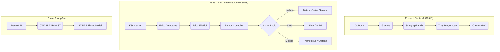

# 🛡️ KubeGuard: Cloud-Native Security Orchestrator

KubeGuard is a full-stack security orchestration system designed to protect Kubernetes clusters through a multi-layered defense-in-depth strategy. It combines shift-left scanning, runtime threat detection, and automated self-healing.

## 🏗️ Architecture Overview



## 🔐 Security Layers

| Layer | Component | Implementation |
| :--- | :--- | :--- |
| **1. DevSecOps** | GitHub Actions | Automated SAST, Secrets, SCA, and IaC scanning. |
| **2. Runtime** | Falco | Syscall-level detection with custom rules for lateral movement. |
| **3. Self-Healing** | Python Core | FastAPI controller that quarantined pods via labels/NetPol. |
| **4. AppSec** | OWASP Top 10 | Vulnerable demo app + ZAP scanning + HMAC webhook signing. |
| **5. Observability** | SIEM / Metrics | Wazuh integration + Prometheus/Grafana dashboards. |

## 🚀 Quick Start (Local Lab)

### 1. Prerequisites
- Docker & Kind
- kubectl & Helm
- Python 3.10+

### 2. Setup Environment
```bash
# Create Kind cluster with Falco mounts
kind create cluster --config infra/kind-config.yaml

# Build and Load Controller
docker build -t kubeguard-controller:latest ./controller
kind load docker-image kubeguard-controller:latest
```

### 3. Deploy Stack
```bash
kubectl apply -f infra/controller-deploy.yml
kubectl apply -f infra/quarantine-policy.yml
kubectl apply -f infra/redis-deploy.yml
```

## 📊 Security Findings (Example)
- **SAST**: Identified 7 issues (Medium/Low) in the Python controller (Hardcoded /tmp, Bind all interfaces).
- **Image Scan**: Trivy detected CVE-2026-24049 (HIGH) in the `wheel` package.
- **DAST**: OWASP ZAP identified SQL Injection and IDOR in the demo application.

## 📄 Documentation
- [Threat Model (STRIDE)](docs/threat-model.md)
- [Incident Runbook](docs/runbook.md)
- [ZAP DAST Report](demo-app/zap_report.html)
